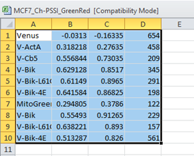

# Multichannel Colocalization Analysis
# STEP 1: Run cell profiler script on your data
- clear image data and upload your dataset
- update the channels in metadata to match your dataset
- run through test mode and play with filter settings until satisfied with identify primary/secondary objects
- change directory for saving data
- upload all images and run code
Note: this script has no intensity filters, just a simple filter by size and then a filter to remove cells that 
have multiple nuclei 
RESULT: The Cell profiler script, "Colocalization_addNucOverlapfilter" exports mutiple files
(see example in folder Example data> subfolder, "Exported_CellProfiler") 
In our example we only need: 
1. "20191010Image"
this contains the filename (RowColumnFeild of view) and lists corresponding Image number/object number.
2. "20191010Mask_Size_OneNuclei"
Contains ROI colocalization data for BR,BG,GR channels, size of ROI, median and mean Venus, Cyan and Red channel intensity. 
However, the exported data does not have my column/row information.  This is our second step in the analysis. 

#STEP 2: Get Row/Column identity for full dataset
To prepare data to run through open Both 1) "20191010Image" and 2) "20191010Mask_Size_OneNuclei" and duplicate the first
row * to add a second title row in the data.  Then save these files as, "filename.csv" and "Colocalization.csv", respectively. 
ie. See duplicate title: 

 
You can see examples of these files in the Example data folder. 
-Move your "filename.csv" and "Colocalization.csv" into the same folder as "Step2_Get_RowColumn"
- In folder "Step2_Get_RowColumn" > open "ConvertImageNumber_toWellID.m" in MATLAB
- Note IFF you have used another Cell profiler code, you must update parameter “N” to match number of columns in your results and update parameter “keep_col_title” to match column titles in your exported dataset. 
- Run the  "ConvertImageNumber_toWellID.m"  code
- RESULT: you will see nothing* however the code has generated the matching ROW/column ID for your dataset. It will be located in MATLAB > Workspace (can show in Layout > check “workspace”).   In workspace, listed are Values.  Next to “{} test” see “#### x1 cell”, which is the number of rows in your “Colocalization.csv”.  Note if you are running our example you should see {} test =  441545x1 cell.  Click the #### x1 cell and it will open a new window.  Ie.  

New window will appear in MATLAB.  Highlight this entire column and copy these results. (Note it may take a few mins if your dataset is large). 

- Next open your “Colocalization.csv” file in Microsoft Excel.  Save a new file as “Colocalization.xlsx”. Delete the duplicate of the first row.  Then paste the column you copied to the right of your data.  

Insert a title “Row” “column” so data lines up with the number of rows you have in your dataset.   Use “Text to column function” in Excel to isolate the row and column number.  Ie. We do this in 3 steps here. 
 < br>
 < br>
 < br>
Results 
 < br>
Then, replace the column “Image number” “Object number” with data from Row and Column ID.  Ie. 
 < br>
Save. “Colocalization.xlsx”
STEP 3: Filter and plot colocalization data
Preparation: Create platemap
Use this exact format. The next MATLAB script uses this text data to find/sort the data. Finds unique cell line + red channel combinations.  Then it gets all unique names in the Green channel.  And plots the data.  If cyan channel is “none” the script will only plot the Green:Red colocalization data.  
 < br>
**Rules:** 
- if any channel is empty, indicate by “none” lowercase.
- Open “FilterAndPlotColocalizationData.m” in MATLAB
- Update the parameter:  path_to_data  Ie. Paste path to your Colocalization.xlsx file in between ‘ ‘  
As shown below  
 < br>

-Update the parameter: platemap_excel_path
paste between ‘ ‘
And update the excel_filename and sheet_name corresponding to your Platemap
 < br>
 < br>
**NOTE**  
This script can be adapted to data output from another Cellprofiler script as follows.  
You would need to tell the script at these parameters in order to get the right column location of the data.
 < br>
MedianIntensity_Red_col = 10;  for example means the script can find the Median intensity of the Red channel at column 10 in my Colocalization.xlsx file. 
and also will need to update these parameters: 
  
- input your desired filtering parameters. 
  
For example, here we are only keeping data that has a median intensity of 0.001 in the red column and a median intensity of 0.001 in the green column.  You can add filters for Blue channel or for Size of ROI as shown here for example. 
  
Note we decided on our filters by opening the raw data - looking at untransfected (negative) verses stained/transfected (positive) > plot as a scatter plot and then update the intensity filters in MATLAB. 
  
Black arrow points to where data falls for the untransfected cells.  We set threshold >0.001 and plot data for only Venus positive cells.
-Run the analysis.  The script will export data to the same folder as the “FilterAndPlotColocalizationData.m” script.  
  
Name of the file = “Cell line_what is in Red channel_what 2 channels are colocalized” 
In this example above, we have MCF7 cells, stably expressing mCherry-PSSI and the data plotted is the colocalization of the Green and Red channels.
The resulting data is exported in 3 formats :  EPS, JPG and Summarized Results in Microsoft Excel 
  
See example data Box plot is created only if you have more than 50 data points. The Red cross is the “Mode”. 
  
Where Column: 
- A tells you what is in the Green Channel.  
- B is the Median Pearson’s correlation. 
- C is the Mode Pearson’s correlation.  
- D is the number of points.   
**Note** we export the Median and mode even if data has less than 50 points.  Can filter data to exclude. 
  
-Optional: Combine all the files (ie above) for easy navigation.  
We have one file per cell line.  Sometimes it is a lot to combine depending on the dataset. We use the “RDB Merge” Plugin in Microsoft Excel.  Download from the web then add to plugins.  
  
- Run RDBMerge
  
- Browse > input path to your data
- Select “XLS”
- Indicate range as shown
- Save file name* this will keep your cell type/Red stain and colocalization. 
- Select “Merge” and it will run
- RESULT: all files combined.  
  
- use Text to column function in Excel to separate your Cell ID, red channel and colocalization. 
